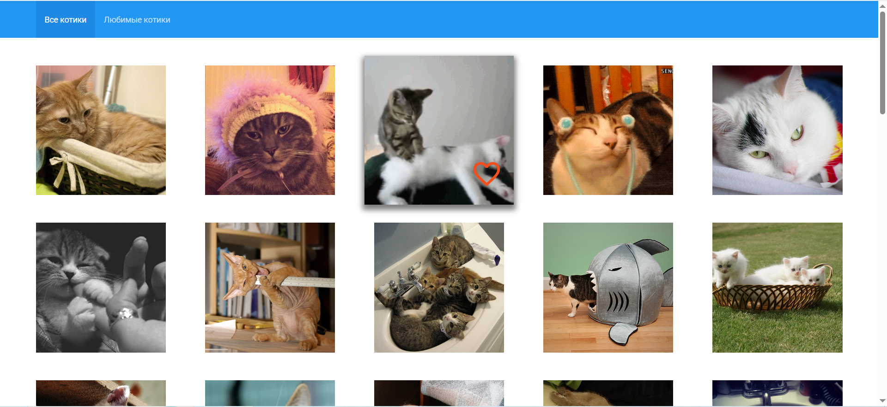
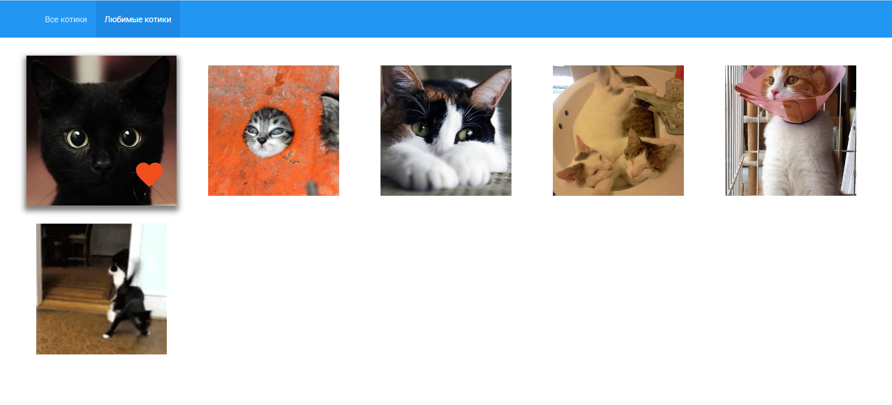

# Кошачий пинтерест

## Описание
Приложение на React, которое позволяет смотреть бесконечное количество котиков и добавлять их в избраннее.

##  Технологии

- React + Redux Toolkit
- TypeScript
- SCSS
- Vite

## Возможности

- Просмотр котиков
- Добавление котиков в избранные
- Просмотр понравивишихся котиков

## Установка

1. Клонируйте репозиторий: git clone https://github.com/Elmir-52/frontend-challenge.git
2. Установите зависимости: npm install

## Использование

1. Включите VPN
2. Запустите приложение: npm run dev

## Скриншоты

- Скриншот страницы "Все котики"

- Скриншот страницы "Любимые котики"

## Разработчики

- Эльмир Караев - [GitHub](https://github.com/Elmir-52) - Ведущий разработчик